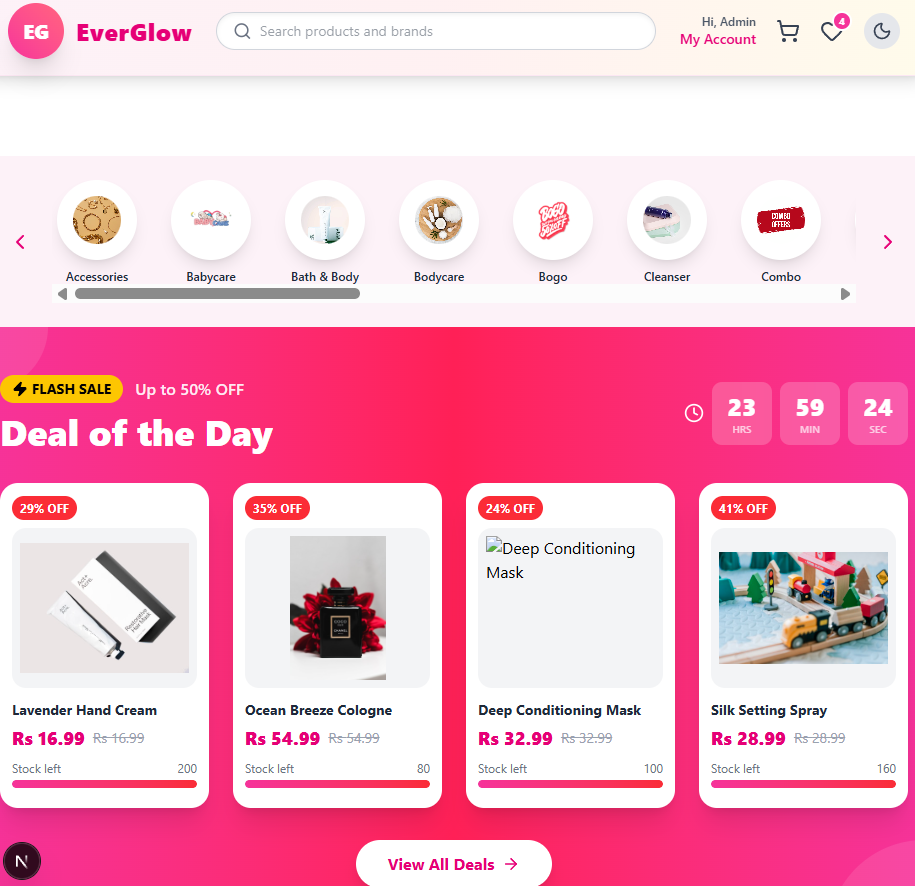
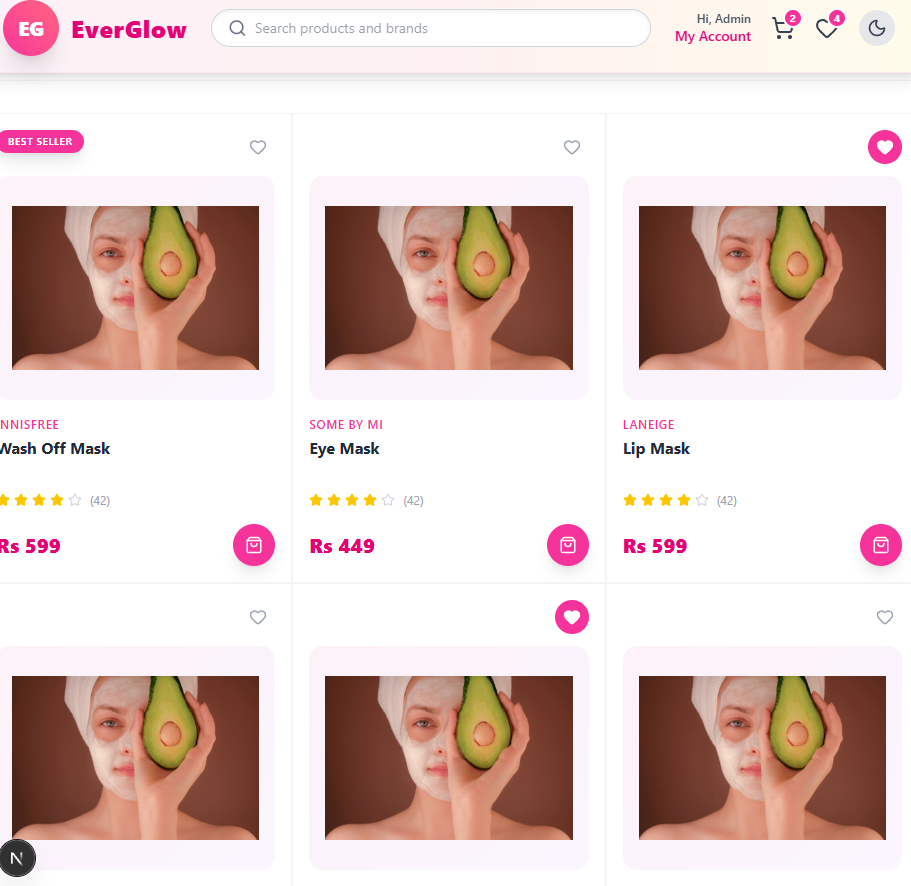
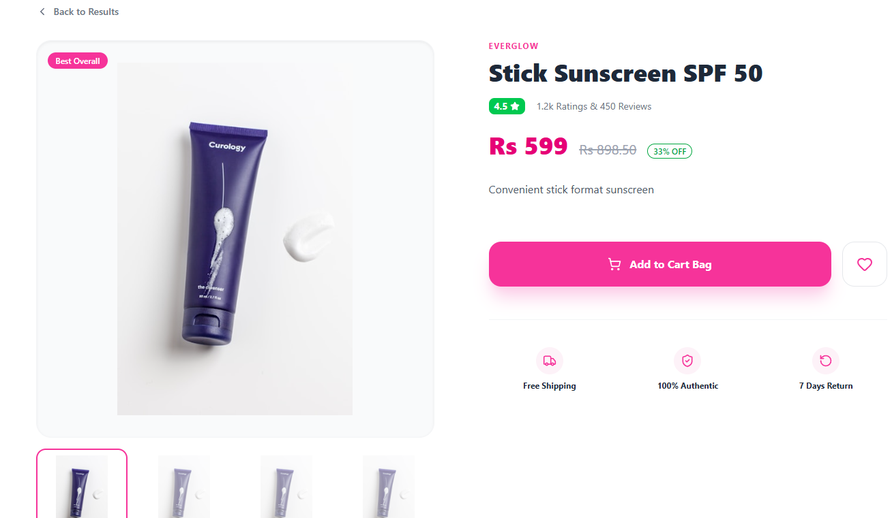
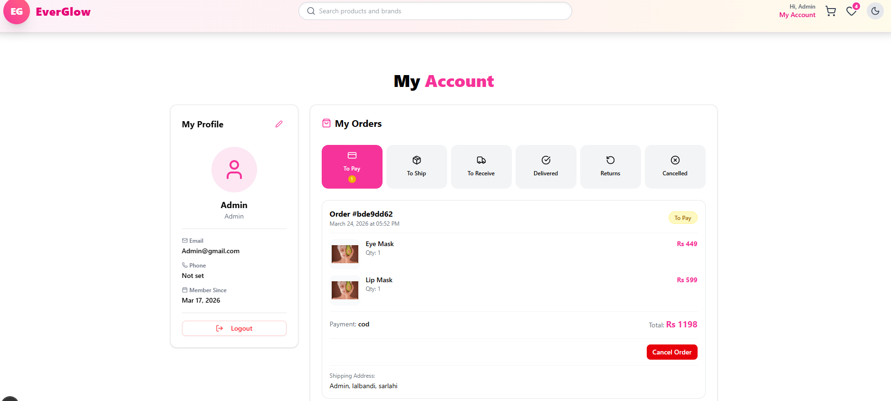
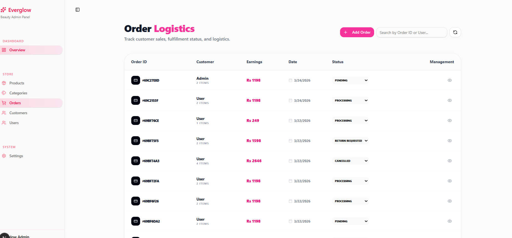
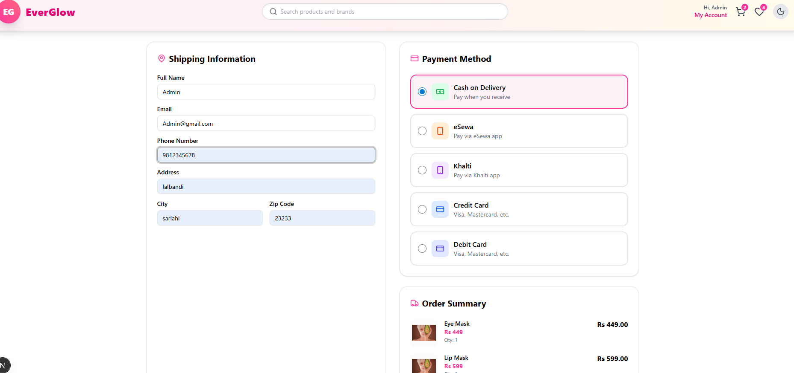
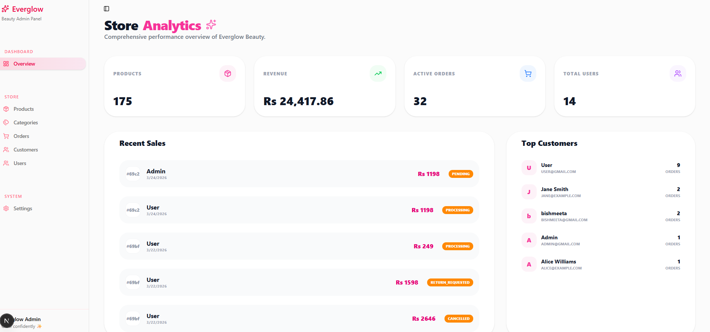

# E-Commerce Platform

A full-stack e-commerce application with a Next.js frontend and Express.js backend.

---

## 📸 Screenshots

### Home Page

_Main landing page with featured products and promotions_

### Product Listing

_Product catalog with grid view_

### Product Detail - Add to Cart

_Product detail page showing Add to Cart button_

### Admin Dashboard - Add Product

_Admin panel with Add Product functionality_

### User Account

_User account and profile page_

### Admin Dashboard Overview

_Admin dashboard with overview and charts_

### Admin - Payment Processing

_Payment processing in admin dashboard_

### Overview

_Platform overview_

---

## 🏗️ Project Architecture

```
ecommerce/
│
├── frontend/                      # Next.js 14 App Router frontend
│   ├── app/                      # App Router pages
│   │   ├── layout.tsx            # Root layout
│   │   ├── page.tsx              # Home page
│   │   ├── globals.css           # Global styles
│   │   ├── products/             # Product pages
│   │   │   ├── page.tsx          # Product listing
│   │   │   └── [id]/             # Dynamic product detail
│   │   │       └── page.tsx
│   │   ├── carts/                # Shopping cart page
│   │   ├── checkout/             # Checkout page
│   │   ├── profile/              # User profile page
│   │   ├── box/                  # Box management page
│   │   ├── counter/              # Counter demo page
│   │   ├── (authpage)/           # Auth route group
│   │   │   ├── login/            # Login page
│   │   │   ├── register/        # Register page
│   │   │   ├── forgot-password/ # Forgot password
│   │   │   └── reset-password/   # Reset password
│   │   ├── admin/                # Admin panel
│   │   │   ├── layout.tsx       # Admin layout
│   │   │   ├── page.tsx         # Admin home
│   │   │   ├── dashboard/       # Dashboard
│   │   │   ├── products/        # Product management
│   │   │   ├── categories/      # Category management
│   │   │   ├── orders/          # Order management
│   │   │   ├── customers/       # Customer management
│   │   │   ├── users/           # User management
│   │   │   ├── settings/        # Settings page
│   │   │   └── products/[id]/  # Product edit
│   │   ├── provider/            # Providers
│   │   │   └── apolloprovider.tsx
│   │   └── about/               # About page
│   │
│   ├── components/              # React components
│   │   ├── commerce/            # Commerce components
│   │   │   ├── CartDrawer.tsx
│   │   │   ├── FlashSale.tsx
│   │   │   ├── ItemCard.tsx
│   │   │   ├── ProductCategories.tsx
│   │   │   ├── ProductGrid.tsx
│   │   │   ├── PromotionBanner.tsx
│   │   │   └── WishlistDrawer.tsx
│   │   ├── layout/              # Layout components
│   │   │   ├── Navbar.tsx
│   │   │   └── Footer.tsx
│   │   ├── providers/           # Context providers
│   │   │   └── DarkModeProvider.tsx
│   │   ├── ui/                  # shadcn/ui components
│   │   │   ├── badge.tsx
│   │   │   ├── button.tsx
│   │   │   ├── card.tsx
│   │   │   ├── chart.tsx
│   │   │   ├── dialog.tsx
│   │   │   ├── drawer.tsx
│   │   │   ├── input.tsx
│   │   │   ├── label.tsx
│   │   │   ├── separator.tsx
│   │   │   ├── sheet.tsx
│   │   │   ├── sidebar.tsx
│   │   │   ├── skeleton.tsx
│   │   │   ├── sonner.tsx
│   │   │   ├── switch.tsx
│   │   │   ├── table.tsx
│   │   │   └── tooltip.tsx
│   │   └── app-sidebar.tsx
│   │
│   ├── lib/                     # Utilities and stores
│   │   ├── apolloclient.ts      # Apollo client config
│   │   ├── auth.ts              # Auth utilities
│   │   ├── utils.ts             # General utilities
│   │   └── store/               # Zustand stores
│   │       ├── useBoxStore.ts
│   │       ├── useCartStore.ts
│   │       ├── useCounterStore.ts
│   │       └── useWishlistStore.ts
│   │
│   ├── hooks/                   # Custom React hooks
│   │   ├── use-media-query.ts
│   │   └── use-mobile.ts
│   │
│   ├── public/                  # Static assets
│   │   ├── file.svg
│   │   ├── globe.svg
│   │   ├── next.svg
│   │   ├── vercel.svg
│   │   └── window.svg
│   │
│   ├── package.json
│   ├── next.config.ts
│   ├── tsconfig.json
│   ├── tailwind.config.ts
│   ├── postcss.config.mjs
│   └── eslint.config.mjs
│
├── backend/                     # Express.js API server
│   ├── server.js               # Entry point
│   ├── README.md               # Backend documentation
│   ├── EMAIL_SETUP.md          # Email configuration guide
│   ├── package.json
│   ├── .env                    # Environment variables
│   │
│   ├── src/
│   │   ├── controllers/         # Request handlers
│   │   │   ├── auth.js
│   │   │   ├── brand.js
│   │   │   ├── category.js
│   │   │   ├── order.js
│   │   │   ├── product.js
│   │   │   └── review.js
│   │   │
│   │   ├── models/             # Mongoose models
│   │   │   ├── brand.js
│   │   │   ├── category.js
│   │   │   ├── order.js
│   │   │   ├── product.js
│   │   │   ├── review.js
│   │   │   └── user.js
│   │   │
│   │   ├── routes/             # API routes
│   │   │   ├── auth.js
│   │   │   ├── brand.js
│   │   │   ├── category.js
│   │   │   ├── order.js
│   │   │   ├── product.js
│   │   │   ├── review.js
│   │   │   └── user.js
│   │   │
│   │   ├── middleware/         # Auth & custom middleware
│   │   │   └── auth.js
│   │   │
│   │   ├── db/                 # Database connection
│   │   │   └── connect.js
│   │   │
│   │   └── utils/              # Utility functions
│   │       └── email.js        # Nodemailer email service
│   │
│   ├── seed-all-categories.js  # Database seeding
│   ├── seed-beauty-products.js
│   ├── seed-brands-products.js
│   ├── seed-categories.js
│   └── seed-users.js
│
├── plans/                      # Planning documents
│   └── backend-blueprint.md
│
├── package.json                # Root package.json
├── package-lock.json
└── README.md
```

---

## 🛠️ Tech Stack

### Frontend
- **Framework:** Next.js 14 (App Router)
- **Styling:** Tailwind CSS
- **UI Components:** shadcn/ui
- **Icons:** Lucide React
- **State Management:** Zustand (cart, wishlist, box, counter stores)
- **Dark Mode:** DarkModeProvider with context
- **Data Fetching:** Apollo Client

### Backend
- **Runtime:** Node.js
- **Framework:** Express.js
- **Database:** MongoDB with Mongoose
- **Authentication:** JWT-based auth
- **Password:** bcryptjs for hashing
- **Email:** Nodemailer for sending emails

---

## ✅ Features

### Frontend
- [x] Next.js 14 App Router
- [x] Product listing with responsive grid
- [x] Product detail pages with dynamic routing
- [x] Shopping cart with Zustand state management
- [x] Wishlist functionality
- [x] Box management
- [x] Dark/Light mode toggle
- [x] Authentication pages (Login, Register, Forgot Password, Reset Password)
- [x] Full admin panel with:
  - [x] Dashboard with charts
  - [x] Product management (CRUD)
  - [x] Category management
  - [x] Order management
  - [x] Customer management
  - [x] User management
  - [x] Settings

### Backend
- [x] RESTful API endpoints
- [x] User authentication (register, login, JWT)
- [x] Product management
- [x] Category management
- [x] Brand management
- [x] Order processing
- [x] Review system
- [x] MongoDB database with Mongoose models

---

## 🚀 Getting Started

### Prerequisites
- Node.js 18+
- MongoDB (local or Atlas)
- npm or yarn

### Backend Setup

```bash
cd backend
npm install
```

Create a `.env` file in the `backend` directory:

```env
# Server Configuration
PORT=5000

# MongoDB Connection
MONGODB_URI=mongodb://localhost:27017/ecommerce

# JWT Secret
JWT_SECRET=your_jwt_secret_key

# Frontend URL (for email links)
FRONTEND_URL=http://localhost:3000

# Email Configuration (Nodemailer)
# For Gmail: Use App Password (not regular password)
EMAIL_HOST=smtp.gmail.com
EMAIL_PORT=587
EMAIL_USER=your_email@gmail.com
EMAIL_PASS=your_app_password

# Email From Address
EMAIL_FROM="EverGlow Beauty" <noreply@everglow.com>
```

> **Note:** See [EMAIL_SETUP.md](backend/EMAIL_SETUP.md) for detailed email configuration instructions.

Start the backend server:

```bash
npm run dev
# or
node server.js
```

The backend will run on `http://localhost:5000`

### Frontend Setup

```bash
cd frontend
npm install
```

Start the development server:

```bash
npm run dev
```

Open `http://localhost:3000` in your browser.

---

## 📡 API Endpoints

### Authentication
- `POST /api/auth/register` - Register new user
- `POST /api/auth/login` - Login user
- `POST /api/auth/forgot-password` - Request password reset email
- `POST /api/auth/reset-password` - Reset password with token
- `GET /api/auth/me` - Get current user (protected)

### Products
- `GET /api/products` - Get all products
- `GET /api/products/:id` - Get single product
- `POST /api/products` - Create product (admin)
- `PUT /api/products/:id` - Update product (admin)
- `DELETE /api/products/:id` - Delete product (admin)

### Categories
- `GET /api/categories` - Get all categories
- `POST /api/categories` - Create category (admin)
- `PUT /api/categories/:id` - Update category (admin)
- `DELETE /api/categories/:id` - Delete category (admin)

### Brands
- `GET /api/brands` - Get all brands
- `POST /api/brands` - Create brand (admin)
- `PUT /api/brands/:id` - Update brand (admin)
- `DELETE /api/brands/:id` - Delete brand (admin)

### Orders
- `GET /api/orders` - Get all orders (admin)
- `GET /api/orders/user` - Get user's orders
- `POST /api/orders` - Create new order
- `PUT /api/orders/:id` - Update order status (admin)

### Reviews
- `GET /api/reviews/product/:productId` - Get product reviews
- `POST /api/reviews` - Create review (authenticated)

### Users
- `GET /api/users` - Get all users (admin)
- `GET /api/users/:id` - Get user by ID (admin)
- `PUT /api/users/:id` - Update user (admin)
- `DELETE /api/users/:id` - Delete user (admin)

---

## 📂 Key Frontend Routes

| Route | Description |
|-------|-------------|
| `/` | Home page with products |
| `/products` | Product listing |
| `/products/[id]` | Product detail |
| `/carts` | Shopping cart |
| `/checkout` | Checkout page |
| `/profile` | User profile |
| `/login` | Login page |
| `/register` | Registration page |
| `/admin` | Admin dashboard |
| `/admin/products` | Product management |
| `/admin/orders` | Order management |
| `/admin/customers` | Customer management |
| `/admin/categories` | Category management |
| `/admin/users` | User management |
| `/admin/settings` | Settings |

---

---

## 📚 Documentation

- [Backend README](backend/README.md) - Detailed backend documentation
- [Email Setup Guide](backend/EMAIL_SETUP.md) - How to configure email (Nodemailer)

---

## 📄 License

This project is open source and available for learning and development purposes.

---

## 🤝 Contributing

Contributions are welcome! Please feel free to submit a Pull Request.
