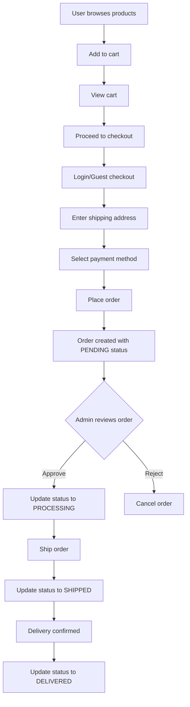
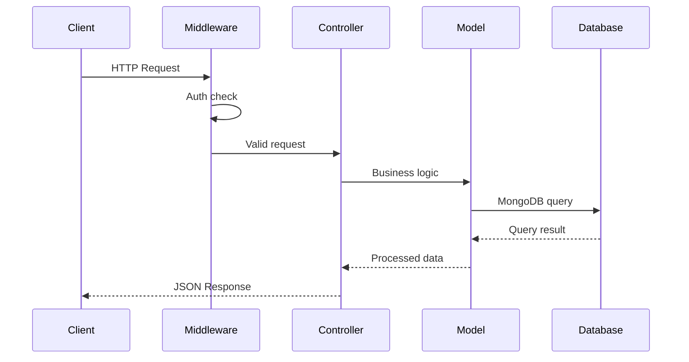

# Backend Blueprint - EverGlow E-Commerce Platform

## Table of Contents
1. [Overview](#overview)
2. [Database Models](#database-models)
3. [API Routes](#api-routes)
4. [Controllers](#controllers)
5. [Middleware](#middleware)
6. [Authentication & Authorization](#authentication--authorization)
7. [Data Flow Diagrams](#data-flow-diagrams)

---

## Overview

This document outlines the complete backend architecture for the EverGlow e-commerce platform. The backend is built with **Node.js**, **Express**, and **MongoDB** (using Mongoose ODM).

### Technology Stack
- **Runtime**: Node.js
- **Framework**: Express.js
- **Database**: MongoDB with Mongoose
- **Authentication**: JWT (JSON Web Tokens)
- **Password Hashing**: bcryptjs

### Base URL
```
http://localhost:5000/api
```

---

## Database Models

### 1. User Model
**File**: `backend/src/models/User.js`

```javascript
{
  _id: ObjectId,
  name: String (required, min: 2, max: 100),
  email: String (required, unique, valid email),
  password: String (required, min: 6, hashed),
  phone: String (optional),
  role: String (enum: ['USER', 'ADMIN'], default: 'USER'),
  avatar: String (optional, URL),
  isActive: Boolean (default: true),
  addresses: [{
    _id: ObjectId,
    label: String (e.g., 'Home', 'Office'),
    street: String,
    city: String,
    state: String,
    zipCode: String,
    country: String (default: 'Nepal'),
    isDefault: Boolean
  }],
  wishlist: [{ type: ObjectId, ref: 'Product' }],
  createdAt: Date,
  updatedAt: Date
}
```

**Relationships**:
- Has many Orders (one-to-many)
- Has many addresses (embedded)
- Has wishlist of Products (many-to-many)

---

### 2. Product Model
**File**: `backend/src/models/Product.js`

```javascript
{
  _id: ObjectId,
  name: String (required, min: 2, max: 200),
  slug: String (required, unique, URL-friendly),
  description: String (required),
  price: Number (required, min: 0),
  originalPrice: Number (optional, for discount calculation),
  stock: Number (default: 0, min: 0),
  sku: String (unique, optional),
  images: [{
    _id: ObjectId,
    url: String (required),
    alt: String,
    isPrimary: Boolean (default: false)
  }],
  brand: { type: ObjectId, ref: 'Brand' },
  category: { type: ObjectId, ref: 'Category', required: true },
  tags: [String],
  specifications: Object (optional, key-value pairs),
  isActive: Boolean (default: true),
  isFeatured: Boolean (default: false),
  rating: Number (default: 0, min: 0, max: 5),
  reviewCount: Number (default: 0),
  soldCount: Number (default: 0),
  createdAt: Date,
  updatedAt: Date
}
```

**Virtuals**:
- `discountPercentage`: Calculates discount from price vs originalPrice

**Relationships**:
- Belongs to one Brand (many-to-one)
- Belongs to one Category (many-to-one)
- Has many OrderItems (one-to-many)
- In many Wishlists (many-to-many)

---

### 3. Category Model
**File**: `backend/src/models/Category.js`

```javascript
{
  _id: ObjectId,
  name: String (required, unique, min: 2, max: 100),
  slug: String (required, unique, URL-friendly),
  description: String (optional),
  image: String (optional, URL),
  parentCategory: { type: ObjectId, ref: 'Category' },
  isActive: Boolean (default: true),
  displayOrder: Number (default: 0),
  createdAt: Date,
  updatedAt: Date
}
```

**Relationships**:
- Has many Products (one-to-many)
- Can have parent Category (self-referencing, for subcategories)

---

### 4. Brand Model
**File**: `backend/src/models/Brand.js`

```javascript
{
  _id: ObjectId,
  name: String (required, unique, min: 2, max: 100),
  slug: String (required, unique, URL-friendly),
  logo: String (optional, URL),
  description: String (optional),
  website: String (optional, URL),
  isActive: Boolean (default: true),
  createdAt: Date,
  updatedAt: Date
}
```

**Relationships**:
- Has many Products (one-to-many)

---

### 5. Order Model
**File**: `backend/src/models/Order.js`

```javascript
{
  _id: ObjectId,
  orderNumber: String (unique, auto-generated),
  user: { type: ObjectId, ref: 'User', required: true },
  items: [{
    _id: ObjectId,
    product: { type: ObjectId, ref: 'Product', required: true },
    name: String (denormalized for history),
    image: String (denormalized),
    price: Number (price at time of purchase),
    quantity: Number (required, min: 1),
    total: Number (price * quantity)
  }],
  shippingAddress: {
    fullName: String,
    phone: String,
    street: String,
    city: String,
    state: String,
    zipCode: String,
    country: String
  },
  paymentMethod: String (enum: ['COD', 'CARD', 'KHALTI', 'ESEWA']),
  paymentStatus: String (enum: ['PENDING', 'PAID', 'FAILED', 'REFUNDED'], default: 'PENDING'),
  paymentDetails: {
    transactionId: String,
    paidAt: Date
  },
  subtotal: Number,
  shippingCost: Number (default: 0),
  tax: Number (default: 0),
  discount: Number (default: 0),
  totalAmount: Number,
  status: String (enum: ['PENDING', 'PROCESSING', 'SHIPPED', 'DELIVERED', 'CANCELLED', 'REFUNDED'], default: 'PENDING'),
  notes: String (optional, customer notes),
  trackingNumber: String (optional),
  shippedAt: Date,
  deliveredAt: Date,
  cancelledAt: Date,
  cancellationReason: String,
  createdAt: Date,
  updatedAt: Date
}
```

**Indexes**:
- `orderNumber`: unique
- `user`: for user's order history
- `status`: for filtering by order status
- `createdAt`: for date-based queries

**Relationships**:
- Belongs to one User (many-to-one)
- Has many OrderItems (embedded)

---

### 6. Review Model
**File**: `backend/src/models/Review.js`

```javascript
{
  _id: ObjectId,
  product: { type: ObjectId, ref: 'Product', required: true },
  user: { type: ObjectId, ref: 'User', required: true },
  rating: Number (required, min: 1, max: 5),
  title: String (optional, max: 200),
  comment: String (optional, max: 1000),
  isVerifiedPurchase: Boolean (default: false),
  helpful: [{ type: ObjectId, ref: 'User' }],
  helpfulCount: Number (default: 0),
  status: String (enum: ['PENDING', 'APPROVED', 'REJECTED'], default: 'APPROVED'),
  createdAt: Date,
  updatedAt: Date
}
```

**Relationships**:
- Belongs to one Product (many-to-one)
- Belongs to one User (many-to-one)

---

## API Routes

### Base URL: `/api`

---

### 1. Products Routes
**Prefix**: `/products`

| Method | Endpoint | Description | Auth Required |
|--------|----------|-------------|---------------|
| GET | `/products` | Get all products (with pagination, filters) | No |
| GET | `/products/:slug` | Get single product by slug | No |
| GET | `/products/featured` | Get featured products | No |
| GET | `/products/search` | Search products | No |
| POST | `/products` | Create new product | Admin |
| PUT | `/products/:id` | Update product | Admin |
| DELETE | `/products/:id` | Delete product | Admin |

**Query Parameters** (GET `/products`):
- `page`: Page number (default: 1)
- `limit`: Items per page (default: 12)
- `category`: Filter by category slug
- `brand`: Filter by brand slug
- `minPrice`: Minimum price filter
- `maxPrice`: Maximum price filter
- `search`: Search term
- `sort`: Sort field (price, name, createdAt)
- `order`: Sort order (asc, desc)

---

### 2. Categories Routes
**Prefix**: `/products/categories`

| Method | Endpoint | Description | Auth Required |
|--------|----------|-------------|---------------|
| GET | `/products/categories` | Get all categories | No |
| GET | `/products/categories/:slug` | Get category by slug | No |
| POST | `/products/categories` | Create category | Admin |
| PUT | `/products/categories/:id` | Update category | Admin |
| DELETE | `/products/categories/:id` | Delete category | Admin |

---

### 3. Brands Routes
**Prefix**: `/products/brands`

| Method | Endpoint | Description | Auth Required |
|--------|----------|-------------|---------------|
| GET | `/products/brands` | Get all brands | No |
| GET | `/products/brands/:slug` | Get brand by slug | No |
| POST | `/products/brands` | Create brand | Admin |
| PUT | `/products/brands/:id` | Update brand | Admin |
| DELETE | `/products/brands/:id` | Delete brand | Admin |

---

### 4. Users Routes
**Prefix**: `/users`

| Method | Endpoint | Description | Auth Required |
|--------|----------|-------------|---------------|
| GET | `/users` | Get all users | Admin |
| GET | `/users/me` | Get current user profile | Yes |
| GET | `/users/:id` | Get user by ID | Admin |
| PUT | `/users/:id` | Update user | User/Admin |
| PUT | `/users/:id/role` | Update user role | Admin |
| DELETE | `/users/:id` | Delete (deactivate) user | Admin |
| POST | `/users/:id/addresses` | Add address | Yes |
| PUT | `/users/:id/addresses/:addressId` | Update address | Yes |
| DELETE | `/users/:id/addresses/:addressId` | Delete address | Yes |

---

### 5. Orders Routes
**Prefix**: `/orders`

| Method | Endpoint | Description | Auth Required |
|--------|----------|-------------|---------------|
| GET | `/orders` | Get all orders (admin) / user's orders | Yes |
| GET | `/orders/:id` | Get order by ID | Yes |
| POST | `/orders` | Create new order (checkout) | Yes |
| PUT | `/orders/:id` | Update order | Admin |
| PUT | `/orders/:id/status` | Update order status | Admin |
| DELETE | `/orders/:id` | Cancel order | User/Admin |

---

### 6. Auth Routes
**Prefix**: `/auth`

| Method | Endpoint | Description | Auth Required |
|--------|----------|-------------|---------------|
| POST | `/auth/register` | Register new user | No |
| POST | `/auth/login` | Login user | No |
| POST | `/auth/logout` | Logout user | Yes |
| POST | `/auth/forgot-password` | Request password reset | No |
| POST | `/auth/reset-password` | Reset password | No |
| GET | `/auth/refresh-token` | Refresh access token | Yes |

---

### 7. Reviews Routes
**Prefix**: `/reviews`

| Method | Endpoint | Description | Auth Required |
|--------|----------|-------------|---------------|
| GET | `/reviews/product/:productId` | Get reviews for product | No |
| POST | `/reviews` | Create review | Yes |
| PUT | `/reviews/:id` | Update review | Yes |
| DELETE | `/reviews/:id` | Delete review | Yes |

---

## Controllers

### 1. Product Controller
**File**: `backend/src/controllers/product.controller.js`

```javascript
// Functions to implement:
- getAllProducts(req, res)        // Get paginated, filtered products
- getProductBySlug(req, res)      // Get single product
- getFeaturedProducts(req, res)   // Get featured products
- searchProducts(req, res)        // Search products
- createProduct(req, res)         // Create new product (Admin)
- updateProduct(req, res)         // Update product (Admin)
- deleteProduct(req, res)         // Delete product (Admin)
```

---

### 2. Category Controller
**File**: `backend/src/controllers/category.controller.js`

```javascript
// Functions to implement:
- getAllCategories(req, res)       // Get all categories
- getCategoryBySlug(req, res)      // Get single category
- createCategory(req, res)          // Create category (Admin)
- updateCategory(req, res)         // Update category (Admin)
- deleteCategory(req, res)          // Delete category (Admin)
```

---

### 3. Brand Controller
**File**: `backend/src/controllers/brand.controller.js`

```javascript
// Functions to implement:
- getAllBrands(req, res)           // Get all brands
- getBrandBySlug(req, res)          // Get single brand
- createBrand(req, res)             // Create brand (Admin)
- updateBrand(req, res)             // Update brand (Admin)
- deleteBrand(req, res)             // Delete brand (Admin)
```

---

### 4. User Controller
**File**: `backend/src/controllers/user.controller.js`

```javascript
// Functions to implement:
- getAllUsers(req, res)             // Get all users (Admin)
- getUserById(req, res)             // Get user by ID (Admin)
- getCurrentUser(req, res)         // Get current user profile
- updateUser(req, res)              // Update user profile
- updateUserRole(req, res)          // Update user role (Admin)
- deleteUser(req, res)              // Deactivate user (Admin)
- addAddress(req, res)              // Add address
- updateAddress(req, res)           // Update address
- deleteAddress(req, res)           // Delete address
```

---

### 5. Order Controller
**File**: `backend/src/controllers/order.controller.js`

```javascript
// Functions to implement:
- getAllOrders(req, res)            // Get all orders (Admin) or user's orders
- getOrderById(req, res)           // Get order by ID
- createOrder(req, res)             // Create new order (checkout)
- updateOrder(req, res)             // Update order (Admin)
- updateOrderStatus(req, res)       // Update order status (Admin)
- cancelOrder(req, res)             // Cancel order
```

---

### 6. Auth Controller
**File**: `backend/src/controllers/auth.controller.js`

```javascript
// Functions to implement:
- register(req, res)                 // Register new user
- login(req, res)                   // Login user
- logout(req, res)                  // Logout user
- forgotPassword(req, res)          // Request password reset
- resetPassword(req, res)           // Reset password
- refreshToken(req, res)             // Refresh access token
```

---

### 7. Review Controller
**File**: `backend/src/controllers/review.controller.js`

```javascript
// Functions to implement:
- getProductReviews(req, res)       // Get reviews for product
- createReview(req, res)             // Create review
- updateReview(req, res)             // Update review
- deleteReview(req, res)             // Delete review
- markHelpful(req, res)              // Mark review as helpful
```

---

## Middleware

### 1. Authentication Middleware
**File**: `backend/src/middleware/auth.js`

```javascript
// Functions:
- verifyToken(req, res, next)       // Verify JWT token
- optionalAuth(req, res, next)       // Optional auth (for guest checkout)
```

### 2. Authorization Middleware
**File**: `backend/src/middleware/authorize.js`

```javascript
// Functions:
- authorize(...roles)               // Role-based access control
- isAdmin(req, res, next)           // Check if user is admin
```

### 3. Validation Middleware
**File**: `backend/src/middleware/validate.js`

```javascript
// Functions:
- validate(schema)                  // Validate request body
- validateQuery(schema)             // Validate query parameters
```

### 4. Error Handling Middleware
**File**: `backend/src/middleware/errorHandler.js`

```javascript
// Functions:
- errorHandler(err, req, res, next) // Global error handler
- notFound(req, res, next)          // 404 handler
```

---

## Authentication & Authorization

### JWT Strategy
- **Access Token**: Expires in 15 minutes
- **Refresh Token**: Expires in 7 days
- **Storage**: HTTP-only cookies (recommended) or localStorage

### Roles
| Role | Description | Permissions |
|------|-------------|-------------|
| USER | Regular customer | View products, manage own profile, create orders, write reviews |
| ADMIN | Store administrator | Full CRUD on all resources, manage users, view all orders |

### Protected Routes
- **Public**: GET /products, GET /products/:slug, GET /categories, GET /brands
- **User**: POST /orders, GET /orders/my-orders, PUT /users/me, POST /reviews
- **Admin**: Full access to all resources

---

## Data Flow Diagrams

### Product Purchase Flow


### API Request Flow


---

## Project Structure

```
backend/
├── src/
│   ├── config/
│   │   ├── db.js              # Database connection
│   │   └── constants.js       # App constants
│   ├── controllers/           # Request handlers
│   │   ├── auth.controller.js
│   │   ├── user.controller.js
│   │   ├── product.controller.js
│   │   ├── category.controller.js
│   │   ├── brand.controller.js
│   │   ├── order.controller.js
│   │   └── review.controller.js
│   ├── middleware/            # Express middleware
│   │   ├── auth.js
│   │   ├── authorize.js
│   │   ├── validate.js
│   │   └── errorHandler.js
│   ├── models/                # Mongoose models
│   │   ├── User.js
│   │   ├── Product.js
│   │   ├── Category.js
│   │   ├── Brand.js
│   │   ├── Order.js
│   │   └── Review.js
│   ├── routes/                # Express routes
│   │   ├── auth.routes.js
│   │   ├── user.routes.js
│   │   ├── product.routes.js
│   │   ├── category.routes.js
│   │   ├── brand.routes.js
│   │   ├── order.routes.js
│   │   └── review.routes.js
│   ├── utils/                 # Utility functions
│   │   ├── ApiError.js
│   │   ├── ApiResponse.js
│   │   ├── asyncHandler.js
│   │   └── validators.js
│   └── app.js                 # Express app setup
├── .env                       # Environment variables
├── package.json
└── server.js                  # Entry point
```

---

## Environment Variables

```env
# Server
PORT=5000
NODE_ENV=development

# Database
MONGODB_URI=mongodb://localhost:27017/ecommerce

# JWT
JWT_ACCESS_SECRET=your_access_secret_key
JWT_REFRESH_SECRET=your_refresh_secret_key
JWT_ACCESS_EXPIRE=15m
JWT_REFRESH_EXPIRE=7d

# Email (for password reset)
SMTP_HOST=smtp.gmail.com
SMTP_PORT=587
SMTP_USER=your_email@gmail.com
SMTP_PASS=your_email_password
FROM_EMAIL=noreply@everglow.com

# File Upload
MAX_FILE_SIZE=5242880
ALLOWED_FILE_TYPES=image/jpeg,image/png,image/webp
UPLOAD_DIR=./public/uploads
```

---

## API Response Format

### Success Response
```json
{
  "success": true,
  "statusCode": 200,
  "message": "Success message",
  "data": {
    // Response data
  },
  "meta": {
    "page": 1,
    "limit": 12,
    "total": 100,
    "totalPages": 9
  }
}
```

### Error Response
```json
{
  "success": false,
  "statusCode": 400,
  "message": "Error message",
  "errors": [
    {
      "field": "email",
      "message": "Invalid email format"
    }
  ]
}
```

---

## Summary

This blueprint provides a complete backend architecture for the EverGlow e-commerce platform. The implementation should follow this structure exactly, ensuring all frontend requirements are met. The key components are:

1. **6 MongoDB Models**: User, Product, Category, Brand, Order, Review
2. **7 Route Groups**: Auth, Users, Products, Categories, Brands, Orders, Reviews
3. **7 Controllers**: Managing all business logic
4. **4 Middleware Types**: Authentication, Authorization, Validation, Error Handling
5. **JWT-based Authentication**: With role-based access control

The frontend expects all these endpoints to be available at `http://localhost:5000/api/`.
